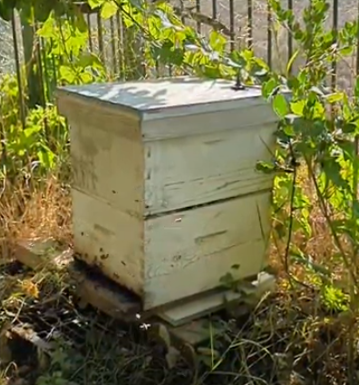
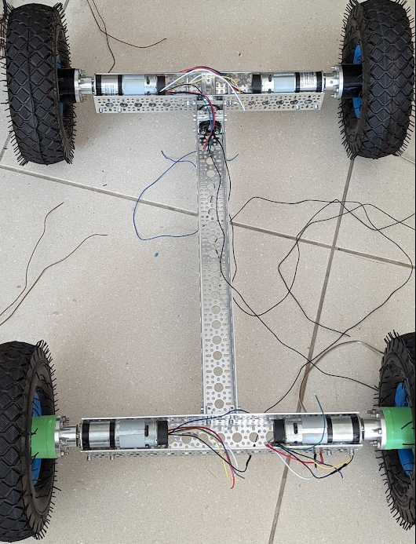
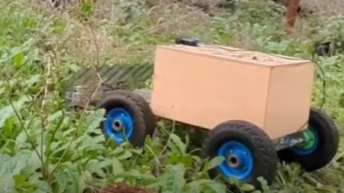

# 1. Bee Hive Monitor

This project focuses on the precise monitoring of hive weight and the temperature both inside and outside the hive.  

This advanced monitoring system plays a crucial role in maintaining the health of the bees.  

By constantly tracking these parameters, we can detect early signs of stress in the hive.  

A key aspect of our system is the regulation and observation of the temperature in the bees' internal nursing area, which is maintained at a constant, optimal level. 

Any fluctuations in this temperature serve as an early warning of potential stress factors affecting the bee colony. 

Moreover, monitoring the hive weight provides valuable insights into the honey production rate, allowing for timely interventions to maximize yield.  

To facilitate real-time monitoring and rapid response, I've developed a mobile app.  

This app brings the critical data directly to the user, enabling efficient and effective hive management. 

{: .left-image} 
<!-- -->
<!--

Click on the thumbnail to see a hive video - you can notice the solar panel and Lora antenna. the hive sits on the weight platform

-->

App view:

{: .left-image-small} 

  

# 2. Auto Mower Robotic - Under development see "Blog" page for updates

 This robot is specifically designed to tackle one of the most challenging aspects of field management: weed control. 
Efficient Weed Removal: The Auto-Mower Robot is engineered to navigate through fields with precision, identifying and eliminating weeds efficiently.   Its advanced sensors and cutting-edge technology allow it to distinguish between crops and unwanted plants, ensuring thorough weed removal without harming your valuable crops. 

Click on the thumbnail to see the robot gallery

Click on the thumbnail to see the robot mower example

<!--{: .custom-class}-->
